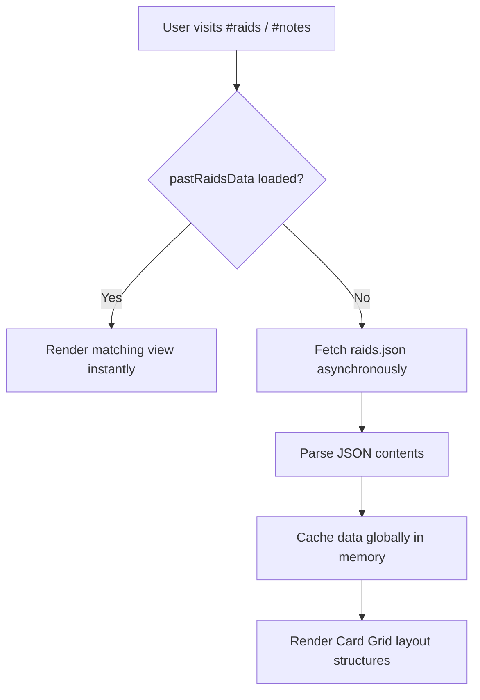

# UITS Event Raiders - JavaScript Code Architecture & Learning Guide

Welcome to the technical learning guide for the **UITS Event Raiders** portal. This guide explores the architecture of [app.js](app.js)—the main client-side JavaScript engine. 

The application is built entirely on raw, vanilla web standards (**HTML5, CSS3, and ES6+ JavaScript**) with zero build steps or framework overhead. This document details how each module works under the hood and how it affects the user experience (UX) and front-end interface.

---

## Table of Contents
1. [Architectural Paradigm: Client-Side SPA](#1-architectural-paradigm-client-side-spa)
2. [Module Breakdown](#2-module-breakdown)
   * [Theme Management (Dark/Light Syncing)](#theme-management-darklight-syncing)
   * [SPA Hash Router & Deep Linking](#spa-hash-router--deep-linking)
   * [Asynchronous Data Layer & Card Renderers](#asynchronous-data-layer--card-renderers)
   * [Interactive Campaign Calendar Controller](#interactive-campaign-calendar-controller)
   * [Custom Category Dropdown Filter](#custom-category-dropdown-filter)
   * [Mobile Velocity Scroll Multiplier](#mobile-velocity-scroll-multiplier)
   * [Client-Side Caching & Local Storage Engine](#client-side-caching--local-storage-engine)
   * [OneSignal Web Push Integration & Background Workers](#onesignal-web-push-integration--background-workers)
   * [GitHub Actions Automated Pipeline](#github-actions-automated-pipeline)
3. [User Experience (UX) Impact Matrix](#3-user-experience-ux-impact-matrix)

---

## 1. Architectural Paradigm: Client-Side SPA
The portal operates as a **Single Page Application (SPA)** where all page sections are loaded into the DOM statically on the first request but visibility is toggled dynamically. Heavy resources—such as event logs, calendar configurations, and technical writeups—are queried asynchronously using the Fetch API only when needed.

This approach delivers:
* **Sub-millisecond navigation transitions** without browser reloads.
* **Compact bandwidth profile**, downloading only the core framework layout first, then loading raw event lists on demand.
* **Offline-friendly rendering capabilities** once initial page assets are cached by the browser.

---

## 2. Module Breakdown

### Theme Management (Dark/Light Syncing)
* **Target Elements:** `body.light-theme`, `#theme-toggle`.
* **State Keys:** `localStorage.getItem('theme')`, `window.matchMedia('(prefers-color-scheme: light)')`.

#### How it works:
1. `initializeTheme()` inspects the local storage for an explicit user preference. If none exists, it falls back to the user's system preferences using standard CSS media queries (`matchMedia`).
2. When the user clicks the theme toggle button, `toggleTheme()` toggles the `.light-theme` class on the `<body>` element and saves the state.
3. Accessibility properties (`aria-label`) are updated dynamically via `updateThemeToggleAccessibility()` to describe the toggling outcome.

#### UX/Frontend Impact:
* Saves the selected theme persistently so the website loads in the user's preferred layout on subsequent visits.
* Seamless transition between themes using CSS color variables.
* Integrates with the Markdown notes renderer (`render.html`) by synchronizing the local storage theme value.

---

### SPA Hash Router & Deep Linking
* **Methods:** `routePage()`, `scrollToRaid()`.
* **Listener:** `window.addEventListener('hashchange', routePage)`.

#### How it works:
1. The script registers a listener on the `hashchange` browser event. Clicking navigation links (e.g., `<a href="#raids">`) updates the URL hash, firing `routePage()`.
2. The router validates the new hash against `validRoutes`. If an invalid or empty hash is detected, it falls back to `#home` and updates the URL silently via `history.replaceState()`.
3. It iterates over all sections and nav links, adding the `.active` class to matching elements and removing it from others. 
4. **Deep Linking Hooks:** If the hash starts with `#raid-`, it extracts the numeric ID (e.g., `#raid-3`), resets the active category filter, updates section visibility to `#raids`, and calls `scrollToRaid()` to smooth-scroll directly to the target card and pulse its borders using a CSS animation (`.highlighted`).

#### UX/Frontend Impact:
* Natively supports the browser's native **Back / Forward** navigation buttons.
* Allows users to bookmark or share direct URLs to specific events (e.g., `index.html#raid-2`), which automatically focuses and highlights the corresponding card layout.
* Handles note redirects gracefully in the same browser tab, facilitating seamless back-and-forth reading of documentation.

---

### Asynchronous Data Layer & Card Renderers
* **Methods:** `loadPastRaids()`, `filterAndRenderRaids()`, `renderRaids()`, `renderEventNotes()`, `getShortTitle()`, `formatLocalDate()`.
* **Data Origin:** [raids.json](raids.json).

#### How it works:
1. When visiting `#raids` or `#notes`, the app triggers `loadPastRaids()`. It uses the browser's asynchronous `fetch()` API to retrieve event data.
2. An internal flag (`isDataLoading`) prevents duplicate queries from running simultaneously.
3. **Shortening Utility:** `getShortTitle()` programmatically extracts clean event titles (e.g. splitting at colons or brackets) to keep text blocks concise.
4. **Dates Engine:** `formatLocalDate()` translates raw ISO date values (e.g. `2026-07-08`) into formatted local dates (e.g. `8 July 2026`).
5. **Deadlines Checker:** Renders deadlines dynamically. It compares system time against `"RegEndDate"`. If the current time is past the deadline, it appends a red/gray `(Closed)` pill; otherwise, it computes remaining days and styles it in green.
6. **Card Builders:** `renderRaids()` and `renderEventNotes()` loop through the database collections, creating HTML structures dynamically via standard DOM APIs (`document.createElement`) and appending them into layout grids.

#### UX/Frontend Impact:
* Loading skeleton placeholders (`.raid-card.skeleton`) are displayed during retrieval to reduce perceived load time.
* Cards dynamically adapt based on content presence (e.g. omitting deadline fields or links wrapper containers entirely if missing in JSON).
* Truncates descriptions on mobile screens using a CSS clamp combined with a dynamic "See More" button toggle.

---

### Interactive Campaign Calendar Controller
* **Methods:** `initCalendar()`, `renderCalendarGrid()`, `openModal()`, `closeModal()`, `openOverlay()`.

#### How it works:
1. `initCalendar()` hooks events up to month traversal controls, modal drawers, and interactive day overlays.
2. Calendar days are mapped into a grid based on month start offsets and total day counts.
3. The engine parses `"startDate"` keys in the cached events database. If campaigns fall on a given day, it overlays visual indicators.
4. **Overlap Algorithm:** Calculates if multiple events overlap on a single date, rendering a counter badge (`+2`) when necessary.
5. **IntersectionObserver Hook:** Attaches an observer to the static calendar button. Once scrolled past the hero view, it slides in a floating calendar button (`.floating-calendar-btn.show`) at the bottom corner for quick access.

#### UX/Frontend Impact:
* Provides a visual timeline of overlapping events.
* Allows users to click on highlighted calendar dates to display a sliding list overlay of that day's events, which deep-links directly to their detail cards.

---

### Custom Category Dropdown Filter
* **Methods:** `initDropdownFilter()`, `resetTypeFilter()`.
* **State Variable:** `currentFilterType`.

#### How it works:
1. Tracks clicking on custom dropdown options. When a category tag (e.g. "Hackathons") is clicked, it sets `currentFilterType` and calls `filterAndRenderRaids()`.
2. Accessible layout updates (`aria-expanded="true/false"`, `aria-selected="true/false"`) are dispatched on structural triggers.
3. Automatically shuts the active container dropdown menu if the user clicks anywhere else outside the bounds of the container element.
4. `resetTypeFilter()` restores the selector to "All Types" whenever deep links are resolved.

#### UX/Frontend Impact:
* Responsive CSS button structure stays aligned on a single row down to a very narrow mobile screen width of `380px` before stacking.
* Allows students to narrow down the roadmap based on their specific technical disciplines (e.g., filtering out Business Competitions to focus entirely on CTFs).

---

### Mobile Velocity Scroll Multiplier
* **Methods:** `initMobileScrollMultiplier()`.

#### How it works:
1. Checks viewport sizing (`window.innerWidth <= 768`).
2. Listens to `touchstart` and `touchend` events to track scroll directions (`diffY`) and touch interaction duration.
3. Calculates speed: if a touch interaction is completed in under 300 milliseconds and spans a distance greater than 30 pixels, it recognizes it as a velocity flick.
4. Programmatically scrolls the window via `window.scrollBy()` with a scaled multiplier factor (`diffY * 1.2`) using smooth scrolling options.

#### UX/Frontend Impact:
* Counters the default mobile browser drag friction on long lists.
* Delivers fluid, bouncy navigation physics that feel modern and premium.

---

### Client-Side Caching & Local Storage Engine
* **Methods:** `initCacheAndNotifications()`, `checkRegistrationDeadlines()`, `triggerDeadlineNotification()`, `showUiToastNotification()`.
* **State Keys:** `localStorage.getItem('ev_tracker')`, `localStorage.getItem('ev_alert_sent_[raidNum]')`.
* **Data Origin:** [tracker.json](tracker.json).

#### How it works:
1. **Aggressive Cache Bypass:** During initialization, `initCacheAndNotifications()` performs an explicit `fetch('tracker.json', { cache: 'no-cache' })` to download the synchronization registry state directly from the server.
2. **State Validation:** Checks the local storage key `ev_tracker`. If the remote `eventsCount` is greater than the cached count, it immediately invalidates the local cache parameters.
3. **Forced Refresh:** Triggered asynchronously, the app re-fetches `raids.json` using `{ cache: 'no-cache' }` to pull the new event data immediately, updating the local storage parameters and rendering fresh cards.
4. **Deadline Check:** Iterates over the tracker's `activeReminders`. If the client's current date is exactly 1 day prior to a raid's `regEndDate`, it checks if a token flag has been set in `localStorage`. If not, it dispatches notifications and sets the token.

#### UX/Frontend Impact:
* **Immediate Content Availability:** Guarantees that users receive newly deployed campaigns without waiting for browser asset cache expiry (e.g. up to 24 hours).
* **Double-layered Alerting:** Shows a premium glassmorphic toast notification on-screen alongside system notifications so the user is guaranteed to see it.
* **Redundancy Protection:** Commits flags to local storage to block duplicate alerts.

---

### OneSignal Web Push Integration & Background Workers
* **Files:** [index.html](index.html), [OneSignalSDKWorker.js](OneSignalSDKWorker.js).
* **SDK:** `OneSignalSDK.page.js`.

#### How it works:
1. **Page Integration:** `index.html` loads the official CDN-hosted page SDK and runs `OneSignal.init()` with custom theme parameters.
2. **Background Worker:** A service worker file `OneSignalSDKWorker.js` at the root directory level imports the worker engine script from OneSignal to support background push notifications.
3. **Localhost Support:** Includes `allowLocalhostAsSecureOrigin: true` to support developers testing local setups.

#### UX/Frontend Impact:
* Integrates a stylish native-themed opt-in bell button at the bottom-left of the viewport.
* Enables background message delivery even when the user does not have the website active in any browser tab.

---

### GitHub Actions Automated Pipeline
* **Files:** [.github/workflows/notify.yml](.github/workflows/notify.yml), [.github/scripts/send-push.js](.github/scripts/send-push.js).
* **Data Sources:** [raids.json](raids.json), [tracker.json](tracker.json).

#### How it works:
1. **Push Trigger:** Whenever a new raid is merged into `raids.json`, GHA starts the workflow, runs `send-push.js`, reads the newest entry at index `0`, and sends a OneSignal Push message with credentials read from repository secrets.
2. **Cron Trigger:** Every morning at `06:00 AM UTC`, a cron schedule triggers the workflow with a `--deadline-check` flag. The script identifies campaigns closing tomorrow and sends reminders.
3. **State Pushback:** Updates the `activeReminders` and `reminderSent` states inside `tracker.json` and automatically commits/pushes the file back to the repository.

#### UX/Frontend Impact:
* Automates notification dispatches, removing human error.
* Synchronizes tracking registries seamlessly.

---

## 3. User Experience (UX) Impact Matrix

| Component | Code Implementation | Front-end Visual Effect | UX Benefit |
| :--- | :--- | :--- | :--- |
| **Theme Switcher** | `initializeTheme`, `toggleTheme` | Syncs variables (`--bg-primary`, etc.) | Prevents late-night eye strain; honors OS presets. |
| **SPA Router** | `routePage`, `scrollToRaid` | Active menu states, cards pulse highlight | No reload delays; bookmarkable event states. |
| **Notes View** | `renderEventNotes`, `getShortTitle` | Compact card items, same-tab loading | Clean visual dashboard; back button returns safely. |
| **Dynamic Cards** | `renderRaids`, `formatLocalDate` | Clamped texts, deadline status badges | Instantly informs user if registration is active or closed. |
| **Interactive Calendar** | `initCalendar`, `IntersectionObserver` | Month grids, overlay lists, floating buttons | Combines roadmap timeline overview with single-click card access. |
| **Category Filter** | `initDropdownFilter` | Dynamic grid updates | Filters out noise to show relevant competitions. |
| **Scroll Booster** | `initMobileScrollMultiplier` | Accelerated smooth scrolling physics | Fluid list navigation on mobile viewports. |
| **Local Cache Sync** | `initCacheAndNotifications` | Compares counts/dates with remote | Flushes stale cache data on new raid releases instantly. |
| **Deadline Alerts** | `checkRegistrationDeadlines` | Premium glassmorphic toasts & system push warnings | Alerts user exactly 1 day before registration closes; prevents duplicate alerts. |
| **GHA Pipeline** | `send-push.js` & `notify.yml` | Automatic OneSignal API trigger | Sends automated, credentials-secured notifications on new raids or upcoming deadlines. |
